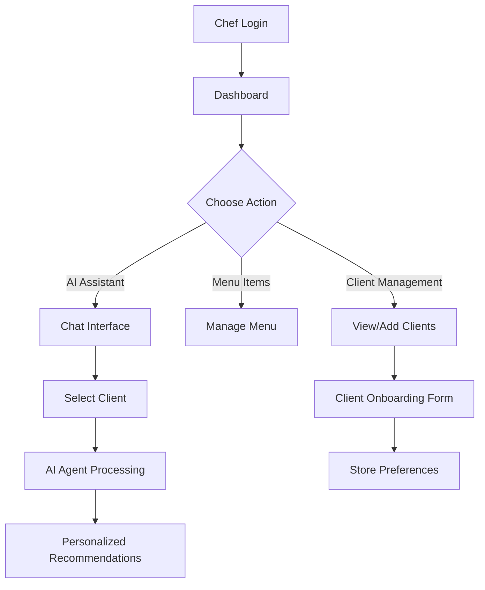

# Sous Agent - AI-Powered Personal Chef Assistant

A comprehensive personal chef management platform that leverages advanced AI agents to provide intelligent menu recommendations, client management, and operational guidance for professional chefs.

## 🏗️ Architecture Overview

**Sous Agent** is built on a modern full-stack architecture combining Next.js 15, Supabase, and advanced AI agent workflows powered by LangChain and OpenAI.

### Core Technologies
- **Frontend**: Next.js 15 with App Router, TypeScript, Tailwind CSS
- **Backend**: Next.js API Routes, Supabase (PostgreSQL + Auth)
- **AI Engine**: LangChain + OpenAI GPT-4o-mini
- **Authentication**: Supabase Auth with Row Level Security
- **Deployment**: Vercel

### Key Features
- 🤖 **AI Menu Assistant** - Personalized menu recommendations using client preferences and feedback
- 👥 **Client Management** - Form-based client onboarding with comprehensive preference tracking
- 🍽️ **Menu Item Management** - Chef's personal menu catalog with advanced filtering
- 📊 **Real-time Dashboard** - Chef operations overview with quick actions
- 🔐 **Secure Authentication** - Multi-tenant architecture with chef-specific data isolation

## 📁 Project Structure

```
src/
├── app/                          # Next.js App Router pages
│   ├── api/                      # API Routes
│   │   └── menu-assistant/       # AI agent endpoints
│   ├── assistant/                # AI chat interface
│   ├── auth/                     # Authentication callbacks
│   ├── clients/                  # Client management pages
│   ├── dashboard-client/         # Main dashboard
│   └── ...
├── components/                   # Reusable UI components
│   ├── ChatInterface.tsx         # AI chat component
│   └── LoadingSkeletons.tsx      # Loading states
├── lib/                          # Core business logic
│   ├── agents/                   # AI agent implementations
│   │   └── menu-assistant.ts     # Main AI workflow
│   ├── supabase.ts              # Database client
│   └── supabase-server.ts       # Server-side DB operations
└── types/                        # TypeScript definitions
    └── database.ts              # Database schema types
```

## 📚 Documentation

This documentation is organized into focused sections for developers:

### Core Documentation
- **[AI Workflow](./docs/ai-workflow.md)** - In-depth guide to the agentic AI system
- **[API Reference](./docs/api-reference.md)** - Complete API endpoints and interfaces
- **[Database Schema](./docs/database-schema.md)** - Database structure and relationships
- **[Component Architecture](./docs/components.md)** - Frontend component organization

### Setup & Deployment
- **[Environment Setup](./docs/environment-setup.md)** - Local development configuration
- **[Deployment Guide](./docs/deployment.md)** - Production deployment instructions

## 🚀 Quick Start

1. **Clone and install dependencies**
   ```bash
   git clone [repository-url]
   cd sous-v1
   npm install
   ```

2. **Configure environment variables**
   ```bash
   cp .env.example .env.local
   # Edit .env.local with your credentials
   ```

3. **Start development server**
   ```bash
   npm run dev
   ```

4. **Open application**
   ```
   http://localhost:3000
   ```

## 🔑 Environment Variables

```env
# Supabase Configuration
NEXT_PUBLIC_SUPABASE_URL=your_supabase_project_url
NEXT_PUBLIC_SUPABASE_ANON_KEY=your_supabase_anon_key
SUPABASE_SERVICE_ROLE_KEY=your_supabase_service_role_key

# OpenAI Configuration (for AI Assistant)
OPENAI_API_KEY=your_openai_api_key

# LangSmith (Optional - for debugging LangChain)
LANGCHAIN_TRACING_V2=false
LANGCHAIN_API_KEY=your_langsmith_api_key
LANGCHAIN_PROJECT=sous-agent
```

## 🧠 AI Agent System

The heart of Sous Agent is its intelligent menu recommendation system that:

1. **Analyzes Client Profiles** - Dietary restrictions, preferences, household size, budget
2. **Processes Chef's Menu** - Available dishes, ingredients, allergens, pricing
3. **Incorporates Feedback History** - Past client ratings and preferences
4. **Generates Contextual Recommendations** - Personalized menu suggestions with reasoning

**Key AI Features:**
- Multi-factor recommendation engine
- Natural language conversation interface
- Real-time preference learning
- Contextual menu matching

## 📊 Application Flow



## 🛠️ Development Commands

```bash
# Development
npm run dev          # Start development server
npm run build        # Build for production
npm run start        # Start production server
npm run lint         # Run ESLint

# Database Operations
# (Handled through Supabase Dashboard)
```

## 🏢 Multi-tenant Architecture

Sous Agent supports multiple chefs with complete data isolation:
- **Chef Authentication** - Individual chef accounts via Supabase Auth
- **Row Level Security** - Database-enforced data isolation
- **Client Segmentation** - Each chef manages only their clients
- **Menu Isolation** - Chef-specific menu items and preferences

## 📈 Performance & Scalability

- **Static Generation** - Pre-rendered pages for optimal performance
- **Edge Functions** - API routes deployed at the edge
- **Real-time Updates** - Supabase real-time subscriptions
- **Caching Strategy** - Browser and CDN caching for static assets

## 🔧 Built With

- [Next.js 15](https://nextjs.org/) - React framework with App Router
- [TypeScript](https://www.typescriptlang.org/) - Type-safe JavaScript
- [Tailwind CSS](https://tailwindcss.com/) - Utility-first CSS framework
- [Supabase](https://supabase.com/) - Backend-as-a-Service (PostgreSQL + Auth)
- [LangChain](https://langchain.dev/) - AI application framework
- [OpenAI](https://openai.com/) - GPT-4o-mini for menu recommendations
- [Vercel](https://vercel.com/) - Deployment and hosting platform

---

**Next Steps**: Explore the [AI Workflow Documentation](./docs/ai-workflow.md) to understand the intelligent recommendation engine that powers Sous Agent.