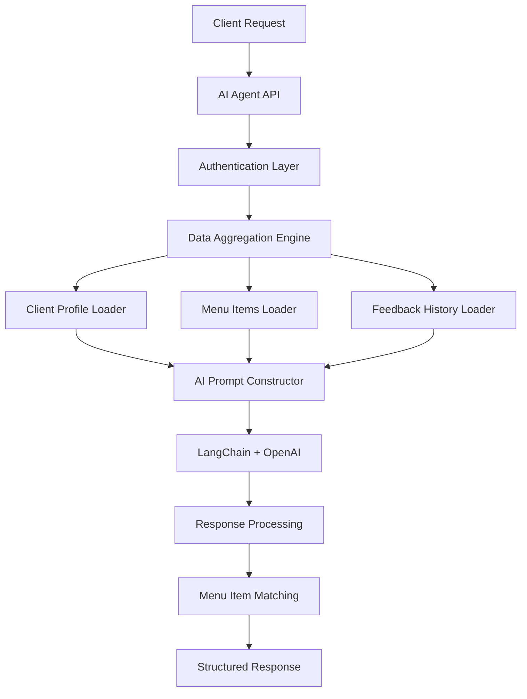

# AI Workflow - Agentic Menu Recommendation System

This document provides an in-depth technical analysis of Sous Agent's AI-powered menu recommendation system, built using LangChain and OpenAI GPT-4o-mini.

## 🏗️ Architecture Overview

The AI agent system is designed as a **contextual reasoning engine** that processes multiple data sources to generate personalized menu recommendations for chefs and their clients.

### Core Components



## 📁 File Structure

```
src/lib/agents/
└── menu-assistant.ts          # Main AI agent implementation

src/app/api/
└── menu-assistant/
    └── route.ts               # API endpoint handler

src/app/assistant/
└── page.tsx                  # Chat interface frontend
```

## 🧠 AI Agent Implementation

### 1. Core Agent Class (`menu-assistant.ts`)

The main AI agent is implemented in `/src/lib/agents/menu-assistant.ts` with the following key functions:

#### **Main Function: `getMenuAssistance()`**

```typescript
export async function getMenuAssistance(request: MenuAssistantRequest): Promise<MenuAssistantResponse>
```

**Input Interface:**
```typescript
interface MenuAssistantRequest {
  clientId: string    // Target client for recommendations
  chefId: string      // Authenticated chef ID
  userMessage: string // Natural language query from chef
}
```

**Output Interface:**
```typescript
interface MenuAssistantResponse {
  message: string                    // AI-generated response
  suggestedMenuItems?: MenuItem[]    // Matched menu items
  reasoning?: string                 // Explanation of recommendations
  success: boolean                   // Operation status
  error?: string                     // Error details if failed
}
```

### 2. Data Aggregation Engine

The AI agent collects comprehensive context through multiple Supabase queries:

#### **Client Profile Data**
```typescript
// Load client basic information
const { data: client, error: clientError } = await supabase
  .from('clients')
  .select('*')
  .eq('id', request.clientId)
  .eq('chef_id', request.chefId)
  .single()
```

#### **Client Preferences Data**
```typescript
// Load detailed dietary preferences
const { data: preferences, error: prefError } = await supabase
  .from('client_preferences')
  .select('*')
  .eq('client_id', request.clientId)
  .single()
```

#### **Available Menu Items**
```typescript
// Load chef's available menu catalog
const { data: menuItems, error: menuError } = await supabase
  .from('menu_items')
  .select('*')
  .eq('chef_id', request.chefId)
  .eq('is_available', true)
```

#### **Historical Feedback**
```typescript
// Load client's past feedback and ratings
const { data: feedback, error: feedbackError } = await supabase
  .from('client_feedback_history')
  .select(`*, menu_items (*)`)
  .eq('client_id', request.clientId)
  .order('created_at', { ascending: false })
  .limit(10)
```

## 🎯 AI Prompt Engineering

### Dynamic Prompt Construction

The AI agent constructs a comprehensive prompt that includes:

1. **Client Profile Context**
2. **Dietary Constraints & Preferences** 
3. **Available Menu Inventory**
4. **Historical Feedback Analysis**
5. **Chef's Specific Query**

#### **Example Prompt Structure**

```typescript
const prompt = `You are an expert personal chef AI assistant helping to create personalized menu recommendations.

CLIENT PROFILE:
- Name: ${client.name}
- Household Size: ${client.household_size}
- Email: ${client.email}

CLIENT DIETARY PREFERENCES:
- Dietary Restrictions: ${preferences.dietary_restrictions?.join(', ') || 'None'}
- Allergies: ${preferences.allergies?.join(', ') || 'None'}
- Cuisine Preferences: ${preferences.cuisine_preferences?.join(', ') || 'Any'}
- Disliked Ingredients: ${preferences.disliked_ingredients?.join(', ') || 'None'}
- Preferred Ingredients: ${preferences.preferred_ingredients?.join(', ') || 'Any'}
- Spice Tolerance: ${preferences.spice_tolerance || 'Medium'}
- Budget per Meal: $${preferences.budget_per_meal || 'Flexible'}

AVAILABLE MENU ITEMS (${menuItems?.length || 0} items):
${menuItems?.map(item => `
- "${item.name}" (${item.cuisine_type})
  Ingredients: ${item.ingredients.join(', ')}
  Allergens: ${item.allergens?.join(', ') || 'None'}
  Tags: ${item.tags?.join(', ') || 'None'}
  Difficulty: ${item.difficulty_level}
  Prep Time: ${item.prep_time_minutes} min
  Price: $${item.price || 'TBD'}
`).join('') || 'No menu items available'}

RECENT FEEDBACK HISTORY:
${feedback?.map(f => `
- ${f.feedback_type}: "${f.feedback_text || f.rating + '/5 stars'}" (${new Date(f.created_at).toLocaleDateString()})
`).join('') || 'No previous feedback'}

USER REQUEST: "${request.userMessage}"

Please provide helpful, personalized menu advice based on the client's preferences and your available menu items. If recommending specific dishes, explain why they're good matches for this client.

Be conversational and professional, as if you're speaking directly to the chef about their client.`
```

### 3. LangChain Integration

#### **Model Configuration**
```typescript
const llm = new ChatOpenAI({
  modelName: 'gpt-4o-mini',        // Fast, cost-effective model
  temperature: 0.7,                // Balanced creativity/consistency
  openAIApiKey: process.env.OPENAI_API_KEY,
})
```

#### **Message Processing**
```typescript
const response = await llm.invoke([new HumanMessage(prompt)])
const aiMessage = response.content as string
```

## 🔍 Intelligent Menu Matching

### Post-Processing Algorithm

After receiving the AI response, the system performs **intelligent menu item extraction**:

```typescript
// Extract recommended menu items from AI response
const suggestedItems: MenuItem[] = []
if (menuItems) {
  for (const item of menuItems) {
    if (aiMessage.toLowerCase().includes(item.name.toLowerCase())) {
      suggestedItems.push(item)
    }
  }
}
```

This algorithm:
1. **Scans the AI response** for menu item name mentions
2. **Matches against available inventory** (case-insensitive)
3. **Returns structured menu objects** for frontend display
4. **Provides context** for why items were recommended

## 🌐 API Endpoint Integration

### Request Flow (`/api/menu-assistant/route.ts`)

```typescript
export async function POST(request: NextRequest) {
  try {
    // 1. Parse request body
    const { clientId, userMessage } = await request.json()
    
    // 2. Validate input
    if (!clientId || !userMessage) {
      return NextResponse.json({ success: false, error: 'Missing required fields' })
    }

    // 3. Authenticate chef
    const { data: { user }, error: userError } = await supabase.auth.getUser(token)
    
    // 4. Process AI request
    const result = await getMenuAssistance({
      clientId,
      chefId: user.id,
      userMessage
    })

    // 5. Return structured response
    return NextResponse.json(result)
    
  } catch (error: any) {
    return NextResponse.json({ success: false, error: error.message })
  }
}
```

### Authentication Security

- **Bearer Token Authentication** - Validates chef session
- **Row Level Security** - Database-enforced access control
- **Client Ownership Validation** - Ensures chef can only access their clients

## 💬 Frontend Chat Interface

### Real-time Chat Experience (`/src/app/assistant/page.tsx`)

The AI agent integrates with a real-time chat interface featuring:

#### **Key Features**
- **Client Selection Dropdown** - Choose which client to get recommendations for
- **Message History** - Persistent conversation context
- **Auto-scroll** - Smooth scrolling to latest messages
- **Thinking Animation** - 3-dot loader during AI processing
- **Error Handling** - Graceful failure recovery

#### **API Integration**
```typescript
const sendMessage = async (message: string, clientId: string) => {
  try {
    const token = await supabase?.auth.getSession()
    const response = await fetch('/api/menu-assistant', {
      method: 'POST',
      headers: {
        'Content-Type': 'application/json',
        'Authorization': `Bearer ${token?.data.session?.access_token}`
      },
      body: JSON.stringify({
        clientId,
        userMessage: message
      })
    })
    
    const result = await response.json()
    
    if (result.success) {
      // Display AI response and suggested menu items
      return result.message
    } else {
      throw new Error(result.error)
    }
  } catch (error) {
    console.error('AI Assistant Error:', error)
    return 'Sorry, I encountered an error. Please try again.'
  }
}
```

## 🧪 AI Reasoning Examples

### Example 1: Dietary Restriction Matching

**Input:**
- Client: "Sarah Johnson" (Vegetarian, Gluten-free)
- Chef Query: "What should I make for Sarah this week?"

**AI Processing:**
1. **Client Analysis** - Identifies vegetarian + gluten-free restrictions
2. **Menu Filtering** - Scans available dishes for compatible options
3. **Preference Matching** - Considers cuisine preferences and past feedback
4. **Recommendation Generation** - Suggests 2-3 specific dishes with reasoning

**Output:**
> "For Sarah this week, I'd recommend the **Quinoa Buddha Bowl** and **Mediterranean Chickpea Salad**. Both dishes align with her vegetarian and gluten-free requirements. The Buddha Bowl includes her preferred ingredients like avocado and roasted vegetables, while the chickpea salad offers Mediterranean flavors she's enjoyed before. Both are nutritious options that fit her medium spice tolerance."

### Example 2: Budget-Conscious Recommendations

**Input:**
- Client: "Mike Chen" (Budget: $15/meal, Family of 4)
- Chef Query: "Budget-friendly options for the Chen family?"

**AI Reasoning Process:**
1. **Budget Constraint Analysis** - $15/meal for 4 people = $3.75/person
2. **Portion Scaling** - Identifies dishes that scale well for families
3. **Cost-Effective Ingredients** - Prioritizes affordable, filling options
4. **Nutritional Balance** - Ensures value without sacrificing nutrition

## 🔧 Error Handling & Resilience

### Robust Error Management

The AI agent includes comprehensive error handling for:

```typescript
// Database connection failures
if (clientError || !client) {
  return {
    success: false,
    error: `Client not found: ${clientError?.message}`,
    message: 'Sorry, I could not find the client information.'
  }
}

// Missing preferences data
if (prefError || !preferences) {
  return {
    success: false,
    error: 'Client preferences not found',
    message: 'Sorry, I could not find the client preferences.'
  }
}

// OpenAI API failures
try {
  const response = await llm.invoke([new HumanMessage(prompt)])
} catch (error: any) {
  return {
    success: false,
    error: error.message,
    message: 'Sorry, I encountered an error while processing your request.'
  }
}
```

## 📊 Performance Optimizations

### 1. Efficient Data Loading
- **Single Transaction** - All database queries use the same Supabase client
- **Selective Fields** - Only loads required data fields
- **Row Level Security** - Database-level filtering reduces data transfer

### 2. AI Model Selection
- **GPT-4o-mini** - Optimized for speed and cost-efficiency
- **Temperature 0.7** - Balanced creativity without hallucinations
- **Prompt Optimization** - Structured prompts for consistent responses

### 3. Caching Strategy
- **Session-based Auth** - Reuses authentication tokens
- **Database Connection Pooling** - Supabase handles connection optimization
- **Response Streaming** - Future enhancement for real-time responses

## 🚀 Future Enhancements

### Planned AI Improvements

1. **Learning Feedback Loop**
   ```typescript
   // Store AI recommendations for learning
   const storeFeedback = async (recommendationId: string, feedback: string) => {
     // Track recommendation success rates
     // Improve future suggestions based on feedback
   }
   ```

2. **Multi-Agent Workflow** (LangGraph Integration)
   ```typescript
   // Planned: Multiple specialized agents
   const menuPlanningAgent = createAgent('menu-planning')
   const nutritionAnalysisAgent = createAgent('nutrition-analysis') 
   const budgetOptimizationAgent = createAgent('budget-optimization')
   ```

3. **Real-time Learning**
   ```typescript
   // Dynamic preference updates
   const updateClientPreferences = async (clientId: string, newPreferences: any) => {
     // Automatically adjust recommendations based on feedback
   }
   ```

## 📈 Monitoring & Analytics

### AI Performance Tracking

- **Response Time Monitoring** - Track API latency
- **Recommendation Accuracy** - Client satisfaction scores
- **Cost Optimization** - OpenAI token usage analytics
- **Error Rate Tracking** - Failure pattern analysis

---

**Next**: Explore [API Reference](./api-reference.md) for complete endpoint documentation and [Database Schema](./database-schema.md) for data structure details.