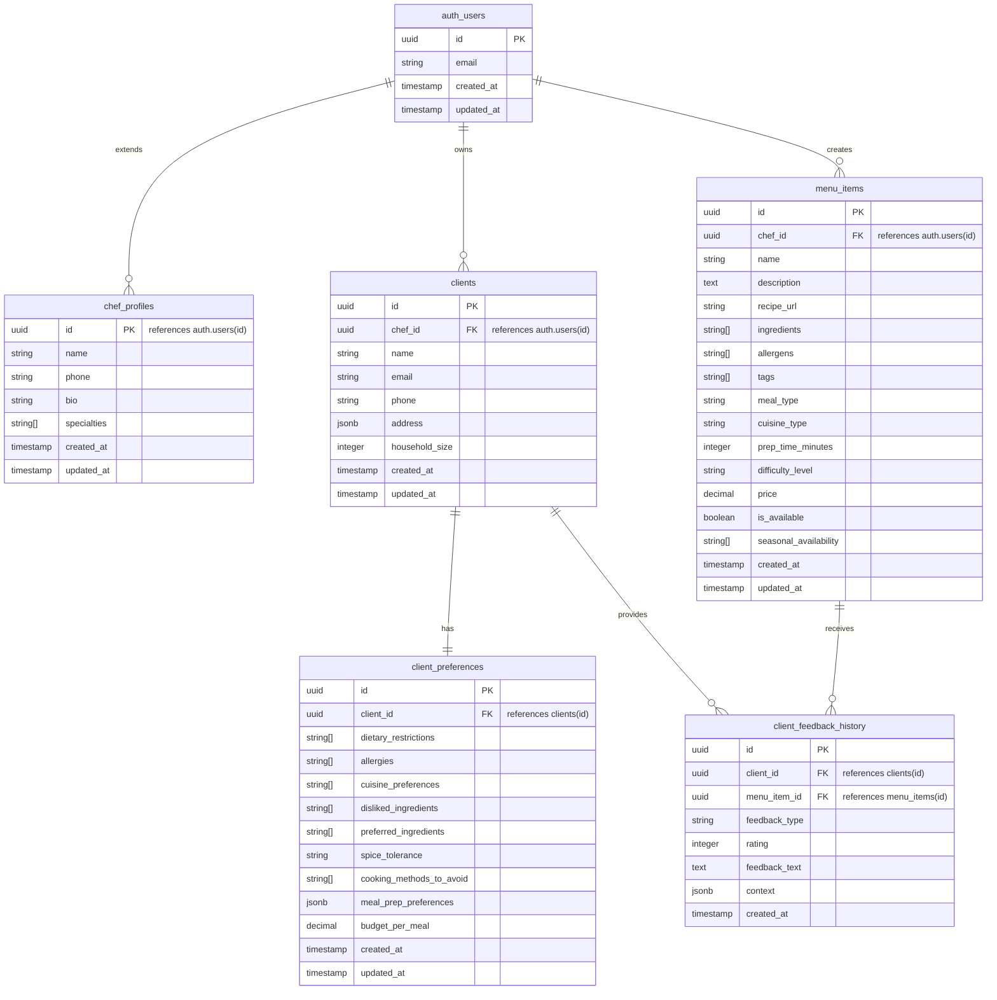

# Database Schema - Sous Agent

This document provides a comprehensive overview of the Supabase PostgreSQL database schema used in Sous Agent, including table structures, relationships, and security policies.

## 🏗️ Schema Overview

The database is designed with a **multi-tenant architecture** where each chef manages their own clients, menu items, and preferences with complete data isolation through **Row Level Security (RLS)**.

### Core Entities



## 📋 Table Definitions

### 1. **auth.users** (Supabase Auth)
Built-in Supabase authentication table for chefs.

```sql
-- Managed by Supabase Auth
-- Core authentication and session management
```

**Key Fields:**
- `id` (uuid) - Primary key, chef identifier
- `email` (string) - Chef's login email
- `created_at` (timestamp) - Account creation time
- `updated_at` (timestamp) - Last profile update

### 2. **chef_profiles**
Extended profile information for chefs.

```sql
CREATE TABLE chef_profiles (
  id uuid REFERENCES auth.users(id) PRIMARY KEY,
  name text,
  phone text,
  bio text,
  specialties text[],
  created_at timestamptz DEFAULT now(),
  updated_at timestamptz DEFAULT now()
);
```

**Usage:**
- Optional extended profile for chefs
- Currently not actively used in the application
- Reserved for future chef profile features

### 3. **clients**
Core client information managed by chefs.

```sql
CREATE TABLE clients (
  id uuid DEFAULT gen_random_uuid() PRIMARY KEY,
  chef_id uuid REFERENCES auth.users(id) NOT NULL,
  name text NOT NULL,
  email text,
  phone text,
  address jsonb,
  household_size integer NOT NULL,
  created_at timestamptz DEFAULT now(),
  updated_at timestamptz DEFAULT now()
);
```

**TypeScript Interface:**
```typescript
export interface Client {
  id: string
  chef_id: string              // Foreign key to auth.users
  name: string                 // Client full name
  email?: string               // Optional client email
  phone?: string               // Optional phone number
  address?: {                  // Optional address object
    street?: string
    city?: string
    state?: string
    zip?: string
  }
  household_size: number       // Number of people to cook for
  created_at: string
  updated_at: string
}
```

**Example Data:**
```json
{
  "id": "123e4567-e89b-12d3-a456-426614174000",
  "chef_id": "987fcdeb-51a2-43d7-8f9e-123456789abc",
  "name": "Sarah Johnson",
  "email": "sarah@example.com",
  "phone": "+1-555-123-4567",
  "address": {
    "street": "123 Main St",
    "city": "San Francisco",
    "state": "CA",
    "zip": "94102"
  },
  "household_size": 2,
  "created_at": "2024-01-15T10:00:00.000Z",
  "updated_at": "2024-01-15T10:00:00.000Z"
}
```

### 4. **client_preferences**
Detailed dietary and culinary preferences for each client.

```sql
CREATE TABLE client_preferences (
  id uuid DEFAULT gen_random_uuid() PRIMARY KEY,
  client_id uuid REFERENCES clients(id) ON DELETE CASCADE NOT NULL,
  dietary_restrictions text[],
  allergies text[],
  cuisine_preferences text[],
  disliked_ingredients text[],
  preferred_ingredients text[],
  spice_tolerance text CHECK (spice_tolerance IN ('none', 'mild', 'medium', 'hot')),
  cooking_methods_to_avoid text[],
  meal_prep_preferences jsonb,
  budget_per_meal decimal(10,2),
  created_at timestamptz DEFAULT now(),
  updated_at timestamptz DEFAULT now()
);
```

**TypeScript Interface:**
```typescript
export interface ClientPreferences {
  id: string
  client_id: string                          // Foreign key to clients
  dietary_restrictions?: string[]            // ["vegetarian", "keto", etc.]
  allergies?: string[]                       // ["nuts", "shellfish", etc.]
  cuisine_preferences?: string[]             // ["italian", "asian", etc.]
  disliked_ingredients?: string[]           // ["mushrooms", "olives", etc.]
  preferred_ingredients?: string[]          // ["chicken", "quinoa", etc.]
  spice_tolerance?: 'none' | 'mild' | 'medium' | 'hot'
  cooking_methods_to_avoid?: string[]       // ["frying", "grilling", etc.]
  meal_prep_preferences?: {
    batch_cooking?: boolean
    individual_portions?: boolean
  }
  budget_per_meal?: number                  // Dollar amount per meal
  created_at: string
  updated_at: string
}
```

**Example Data:**
```json
{
  "id": "456e7890-e12b-34c5-d678-901234567890",
  "client_id": "123e4567-e89b-12d3-a456-426614174000",
  "dietary_restrictions": ["vegetarian", "gluten-free"],
  "allergies": ["nuts", "dairy"],
  "cuisine_preferences": ["mediterranean", "asian", "mexican"],
  "disliked_ingredients": ["mushrooms", "brussels-sprouts"],
  "preferred_ingredients": ["quinoa", "chickpeas", "avocado"],
  "spice_tolerance": "medium",
  "cooking_methods_to_avoid": ["deep-frying"],
  "meal_prep_preferences": {
    "batch_cooking": true,
    "individual_portions": false
  },
  "budget_per_meal": 25.00
}
```

### 5. **menu_items**
Chef's personal menu catalog with detailed dish information.

```sql
CREATE TABLE menu_items (
  id uuid DEFAULT gen_random_uuid() PRIMARY KEY,
  chef_id uuid REFERENCES auth.users(id) NOT NULL,
  name text NOT NULL,
  description text,
  recipe_url text,
  ingredients text[] NOT NULL,
  allergens text[],
  tags text[],
  meal_type text,
  cuisine_type text,
  prep_time_minutes integer,
  difficulty_level text CHECK (difficulty_level IN ('easy', 'medium', 'hard')),
  price decimal(10,2),
  is_available boolean DEFAULT true,
  seasonal_availability text[],
  created_at timestamptz DEFAULT now(),
  updated_at timestamptz DEFAULT now()
);
```

**TypeScript Interface:**
```typescript
export interface MenuItem {
  id: string
  chef_id: string                          // Foreign key to auth.users
  name: string                             // Dish name
  description?: string                     // Dish description
  recipe_url?: string                      // Optional recipe link
  ingredients: string[]                    // Required ingredients list
  allergens?: string[]                     // Allergen warnings
  tags?: string[]                          // Categorization tags
  meal_type?: string                       // "breakfast", "lunch", "dinner"
  cuisine_type?: string                    // "italian", "asian", etc.
  prep_time_minutes?: number               // Preparation time
  difficulty_level?: 'easy' | 'medium' | 'hard'
  price?: number                           // Price per serving
  is_available: boolean                    // Currently available
  seasonal_availability?: string[]         // ["spring", "summer", etc.]
  created_at: string
  updated_at: string
}
```

**Example Data:**
```json
{
  "id": "789e0123-e45f-67g8-h901-234567890123",
  "chef_id": "987fcdeb-51a2-43d7-8f9e-123456789abc",
  "name": "Mediterranean Quinoa Bowl",
  "description": "A healthy quinoa bowl with roasted vegetables, chickpeas, and tahini dressing",
  "recipe_url": "https://example.com/recipes/med-quinoa-bowl",
  "ingredients": ["quinoa", "chickpeas", "bell-peppers", "zucchini", "tahini", "lemon", "olive-oil"],
  "allergens": ["sesame"],
  "tags": ["healthy", "vegetarian", "gluten-free", "high-protein"],
  "meal_type": "lunch",
  "cuisine_type": "mediterranean",
  "prep_time_minutes": 45,
  "difficulty_level": "medium",
  "price": 18.00,
  "is_available": true,
  "seasonal_availability": ["spring", "summer", "fall"]
}
```

### 6. **client_feedback_history**
Historical feedback and ratings from clients about menu items.

```sql
CREATE TABLE client_feedback_history (
  id uuid DEFAULT gen_random_uuid() PRIMARY KEY,
  client_id uuid REFERENCES clients(id) ON DELETE CASCADE NOT NULL,
  menu_item_id uuid REFERENCES menu_items(id) ON DELETE CASCADE NOT NULL,
  feedback_type text CHECK (feedback_type IN ('rating', 'like', 'dislike', 'note')) NOT NULL,
  rating integer CHECK (rating >= 1 AND rating <= 5),
  feedback_text text,
  context jsonb,
  created_at timestamptz DEFAULT now()
);
```

**TypeScript Interface:**
```typescript
export interface ClientFeedbackHistory {
  id: string
  client_id: string                        // Foreign key to clients
  menu_item_id: string                     // Foreign key to menu_items
  feedback_type: 'rating' | 'like' | 'dislike' | 'note'
  rating?: number                          // 1-5 star rating
  feedback_text?: string                   // Written feedback
  context?: Record<string, unknown>        // Additional context data
  created_at: string
}
```

**Example Data:**
```json
{
  "id": "abc1234d-ef56-789g-h012-3456789abcde",
  "client_id": "123e4567-e89b-12d3-a456-426614174000",
  "menu_item_id": "789e0123-e45f-67g8-h901-234567890123",
  "feedback_type": "rating",
  "rating": 5,
  "feedback_text": "Absolutely loved this dish! The tahini dressing was perfect and the vegetables were perfectly roasted.",
  "context": {
    "occasion": "family dinner",
    "portion_size": "perfect",
    "would_order_again": true
  },
  "created_at": "2024-02-01T19:30:00.000Z"
}
```

## 🔐 Row Level Security (RLS)

Sous Agent implements comprehensive RLS policies to ensure complete data isolation between chefs.

### 1. **clients** Table Policies

```sql
-- Chefs can only see their own clients
CREATE POLICY "Chefs can view own clients" ON clients
  FOR SELECT USING (auth.uid() = chef_id);

-- Chefs can insert clients for themselves
CREATE POLICY "Chefs can insert own clients" ON clients
  FOR INSERT WITH CHECK (auth.uid() = chef_id);

-- Chefs can update their own clients
CREATE POLICY "Chefs can update own clients" ON clients
  FOR UPDATE USING (auth.uid() = chef_id);

-- Chefs can delete their own clients
CREATE POLICY "Chefs can delete own clients" ON clients
  FOR DELETE USING (auth.uid() = chef_id);
```

### 2. **client_preferences** Table Policies

```sql
-- Access through client ownership
CREATE POLICY "Access preferences through client ownership" ON client_preferences
  FOR ALL USING (
    client_id IN (
      SELECT id FROM clients WHERE chef_id = auth.uid()
    )
  );
```

### 3. **menu_items** Table Policies

```sql
-- Chefs can only manage their own menu items
CREATE POLICY "Chefs can manage own menu items" ON menu_items
  FOR ALL USING (auth.uid() = chef_id);
```

### 4. **client_feedback_history** Table Policies

```sql
-- Access through client ownership
CREATE POLICY "Access feedback through client ownership" ON client_feedback_history
  FOR ALL USING (
    client_id IN (
      SELECT id FROM clients WHERE chef_id = auth.uid()
    )
  );
```

## 📊 Database Relationships

### Foreign Key Constraints

```sql
-- Client belongs to chef
ALTER TABLE clients 
  ADD CONSTRAINT fk_clients_chef 
  FOREIGN KEY (chef_id) REFERENCES auth.users(id) ON DELETE CASCADE;

-- Preferences belong to client
ALTER TABLE client_preferences 
  ADD CONSTRAINT fk_preferences_client 
  FOREIGN KEY (client_id) REFERENCES clients(id) ON DELETE CASCADE;

-- Menu items belong to chef
ALTER TABLE menu_items 
  ADD CONSTRAINT fk_menu_items_chef 
  FOREIGN KEY (chef_id) REFERENCES auth.users(id) ON DELETE CASCADE;

-- Feedback links client and menu item
ALTER TABLE client_feedback_history 
  ADD CONSTRAINT fk_feedback_client 
  FOREIGN KEY (client_id) REFERENCES clients(id) ON DELETE CASCADE;

ALTER TABLE client_feedback_history 
  ADD CONSTRAINT fk_feedback_menu_item 
  FOREIGN KEY (menu_item_id) REFERENCES menu_items(id) ON DELETE CASCADE;
```

## 🔍 Common Query Patterns

### 1. **Load Client with Preferences** (AI Agent)

```sql
SELECT 
  c.*,
  cp.*
FROM clients c
LEFT JOIN client_preferences cp ON c.id = cp.client_id
WHERE c.id = $1 AND c.chef_id = $2;
```

**TypeScript Usage:**
```typescript
const { data: client, error } = await supabase
  .from('clients')
  .select(`
    *,
    client_preferences (*)
  `)
  .eq('id', clientId)
  .eq('chef_id', chefId)
  .single()
```

### 2. **Load Available Menu Items** (AI Agent)

```sql
SELECT * FROM menu_items 
WHERE chef_id = $1 AND is_available = true
ORDER BY created_at DESC;
```

**TypeScript Usage:**
```typescript
const { data: menuItems, error } = await supabase
  .from('menu_items')
  .select('*')
  .eq('chef_id', chefId)
  .eq('is_available', true)
  .order('created_at', { ascending: false })
```

### 3. **Load Client Feedback History** (AI Agent)

```sql
SELECT 
  cfh.*,
  mi.name as menu_item_name,
  mi.cuisine_type
FROM client_feedback_history cfh
JOIN menu_items mi ON cfh.menu_item_id = mi.id
WHERE cfh.client_id = $1
ORDER BY cfh.created_at DESC
LIMIT 10;
```

**TypeScript Usage:**
```typescript
const { data: feedback, error } = await supabase
  .from('client_feedback_history')
  .select(`
    *,
    menu_items (name, cuisine_type)
  `)
  .eq('client_id', clientId)
  .order('created_at', { ascending: false })
  .limit(10)
```

## 🚀 Performance Optimizations

### Database Indexes

```sql
-- Optimize chef-based queries
CREATE INDEX idx_clients_chef_id ON clients(chef_id);
CREATE INDEX idx_menu_items_chef_id ON menu_items(chef_id);

-- Optimize client-based queries  
CREATE INDEX idx_client_preferences_client_id ON client_preferences(client_id);
CREATE INDEX idx_feedback_client_id ON client_feedback_history(client_id);

-- Optimize menu availability queries
CREATE INDEX idx_menu_items_available ON menu_items(chef_id, is_available);

-- Optimize feedback queries
CREATE INDEX idx_feedback_created_at ON client_feedback_history(created_at DESC);
```

### Query Optimization Tips

1. **Always filter by chef_id first** - Leverages RLS and reduces data scan
2. **Use single() for unique records** - Reduces data transfer
3. **Select specific fields** - Avoid `SELECT *` for large tables
4. **Limit result sets** - Use `.limit()` for pagination

## 🔧 Schema Migrations

### Adding New Fields Example

```sql
-- Add new field to client preferences
ALTER TABLE client_preferences 
ADD COLUMN cooking_skill_level text 
CHECK (cooking_skill_level IN ('beginner', 'intermediate', 'advanced'));

-- Update TypeScript interface accordingly
export interface ClientPreferences {
  // ... existing fields
  cooking_skill_level?: 'beginner' | 'intermediate' | 'advanced'
}
```

## 📈 Monitoring & Analytics

### Useful Analytics Queries

```sql
-- Client count per chef
SELECT 
  u.email,
  COUNT(c.id) as client_count
FROM auth.users u
LEFT JOIN clients c ON u.id = c.chef_id
GROUP BY u.id, u.email;

-- Menu item popularity (based on feedback)
SELECT 
  mi.name,
  COUNT(cfh.id) as feedback_count,
  AVG(cfh.rating) as avg_rating
FROM menu_items mi
LEFT JOIN client_feedback_history cfh ON mi.id = cfh.menu_item_id
WHERE cfh.feedback_type = 'rating'
GROUP BY mi.id, mi.name
ORDER BY feedback_count DESC, avg_rating DESC;
```

---

**Next**: Explore [API Reference](./api-reference.md) for endpoint documentation and [Component Architecture](./components.md) for frontend structure.